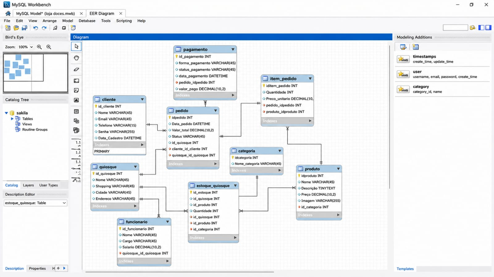

# 🥯 DOCES SOBRE RODAS

<p align="center">
  
</p>

MODELAGEM EM BANCO DE DADOS
---

## 🪪 Identificação

Doces Sobre Rodas: uma loja móvel focada na venda de doces artesanais, com controles 100% manuais.

---

## ⚠️ Problemas

- Desalinhamento do Cardápio: Itens esgotados continuam visíveis para os clientes devido à falta de sincronização com o estoque.

- ​Fragilidade nos Dados: O controle manual gera contagens incorretas e perda de informações por danos físicos aos papéis.

- ​Prejuízo Comercial: A demora no atendimento e a desorganização causam insatisfação nos clientes e perda de vendas.

---

## ✔️ Solução

A automação do atendimento e do controle de estoque, que substituiu planilhas e cardápios físicos, eliminou erros de dados e perda de vendas. Além de zerar a insatisfação dos clientes, a nova solução agilizou o serviço e organizou visualmente os doces por categorias.

---

## 📌 Regras de Negócio

- RN01 (Vínculo de Categoria): Todo produto deve estar obrigatoriamente vinculado a uma categoria (`Chave Estrangeira`).

- RN02 (Nome Único): O nome do produto deve ser exclusivo no sistema para evitar duplicidade no catálogo (`Valor Único`).

- RN03 (Data de Validade): A data de validade do produto não pode ser retroativa, ou seja, deve ser igual ou maior que a data de cadastro (`Regra de Validação`).

- RN04 (Controle de Estoque): A quantidade de produtos em estoque nunca pode ser um valor negativo (`Regra de Validação`).

- RN05 (Itens do Pedido): Um pedido pode conter vários produtos, e um produto pode estar presente em vários pedidos (`Relacionamento N:N`).

- RN06 (Fechamento de Venda): O registro da forma de pagamento é obrigatório para a finalização de qualquer venda (`Preenchimento Obrigatório`).

- RN07 (Preço do Produto): O valor de venda do produto deve ser obrigatoriamente maior que zero (`Regra de Validação`).

---

### 📌 Tabela (MySQL)

<p align="center">
  
</p>

<a href="https://1drv.ms/u/c/53ab9e01f485d193/IQAc1GFvzeXvQJZoDgdy8iyAATiyen1gAfY1ZXxb21G6bc8?e=t3Qxwn" target="_blank" title="Abrir banco de dados MySQL - Doces Sobre Rodas">
  
</a>

---

## 💻 Site

<a href="https://syntaxkills.github.io/doces_sobre_rodas" target="_blank">
  
</a>

<a href="https://1drv.ms/p/c/A0D1E845FA457165/IQC-YBRveSPDTKkW2lwIbCENAfO7-Jw7cTUwqG-fhn3VJ14?e=K0tlp1" target="_blank">
 
</a>

---

## 🛠️ Ferramentas


---

## 👨🏻‍💻 Desenvolvedores

- Victor Cândido Silva
- Alex Júnior Silva Santiago
- Fernanda Costa Pereira de Jesus
- Igor Silva Macedo
- Lucas Gonçalves Araujo Silva
- Eduardo Alarcon da Silva

---

## 📞 Contato

<a href="https://instagram.com/doce_sobre_rodas" target="_blank">
  
</a>

---

## 📄 Documentação

<a href="documento.txt" target="_blank">
 
</a>

---

## doces sobre rodas: doces artesanais de qualidade, unindo automação e sabor para garantir a melhor experiência em cada pedido.

<a href="https://docs.google.com/presentation/d/1Z1JEYpZCUBj-RJkqjyvJypKkr1_7TbpGNy1NsUmmOUc/edit?usp=drivesdk" target="_blank">
 
</a>


```

Copyright © 2026 Doces Sobre Rodas
