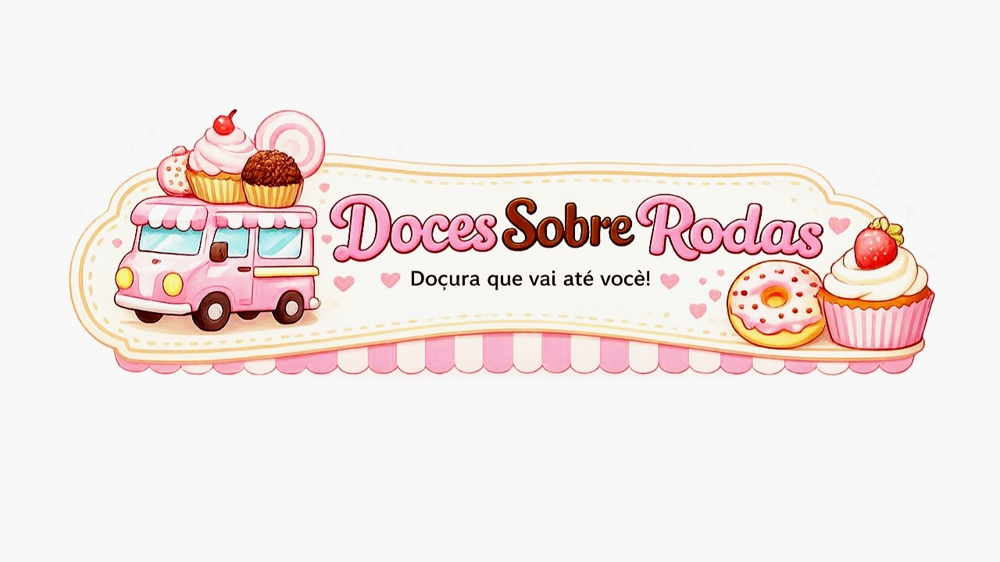
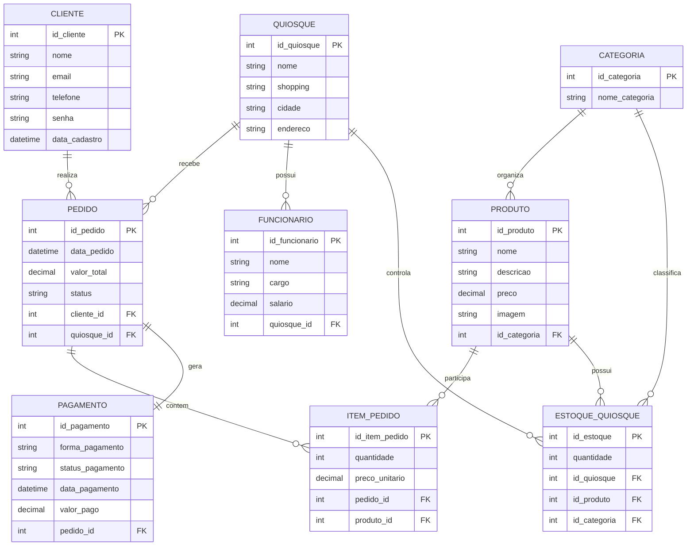

# 🥯 DOCES SOBRE RODAS

<p align="center">
  
</p>

MODELAGEM EM BANCO DE DADOS
---

## 🪪 Identificação

Doces Sobre Rodas: uma loja móvel focada na venda de doces artesanais, com controles 100% manuais.

---

## ⚠️ Problema

Os principais problemas são:

- Erros e Confusões no Cardápio: Os produtos são listados por categoria, mas itens esgotados continuam sendo exibidos, gerando desalinhamento entre o cardápio e o estoque.
  
- Dados Inconsistentes: O controle manual está sujeito a erros de contagem e a acidentes físicos (como papéis molhados ou rasgados), tornando as informações de estoque incertas e pouco confiáveis.
  
- Insatisfação e Perda de Vendas: A falta de organização e a demora para confirmar a disponibilidade dos doces geram uma experiência negativa para os clientes, resultando na perda de vendas.

---

## ✔️ Solução

A substituição de planilhas e cardápios físicos por um sistema automatizado zerou a perda de vendas, os erros de dados e a insatisfação dos clientes.

A nova solução agiliza o atendimento e organiza o estoque de doces por categorias, facilitando a visualização.

---

## 📌 Regras de Negócio

- RN01 (Vínculo de Categoria): Todo produto deve estar obrigatoriamente vinculado a uma categoria (`Chave Estrangeira`).

- RN02 (Nome Único): O nome do produto deve ser exclusivo no sistema para evitar duplicidade no catálogo (`Valor Único`).

- RN03 (Data de Validade): A data de validade do produto não pode ser retroativa, ou seja, deve ser igual ou maior que a data de cadastro (`Regra de Validação`).

- RN04 (Controle de Estoque): A quantidade de produtos em estoque nunca pode ser um valor negativo (`Regra de Validação`).

- RN05 (Itens do Pedido): Um pedido pode conter vários produtos, e um produto pode estar presente em vários pedidos (`Relacionamento N:N`).

- RN06 (Fechamento de Venda): O registro da forma de pagamento é obrigatório para a finalização de qualquer venda (`Preenchimento Obrigatório`).

- RN07 (Preço do Produto): O valor de venda do produto deve ser obrigatoriamente maior que zero (`Regra de Validação`).

---

### 📌 Tabela (MySQL)



---

## 💻 Site

<a href="https://syntaxkills.github.io/doces_sobre_rodas" target="_blank">
  
</a>

---

## 🛠️ Ferramentas


---

## 👨🏻‍💻 Desenvolvedores

- Victor Cândido
- Alex Júnior
- Eduardo Alarcon
- Lucas Gonçalves
- Igor Macedo
- Isaac Matos
- Fernanda Costa

---

## 📞 Contato

<a href="https://instagram.com/doce_sobre_rodas" target="_blank">
  
</a>

---

## 📄 Documentação

<a href="documento.txt" target="_blank">
 
</a>

---

## doces sobre rodas: doces artesanais de qualidade, unindo automação e sabor para garantir a melhor experiência em cada pedido.

```

Copyright © 2026 Doces Sobre Rodas
